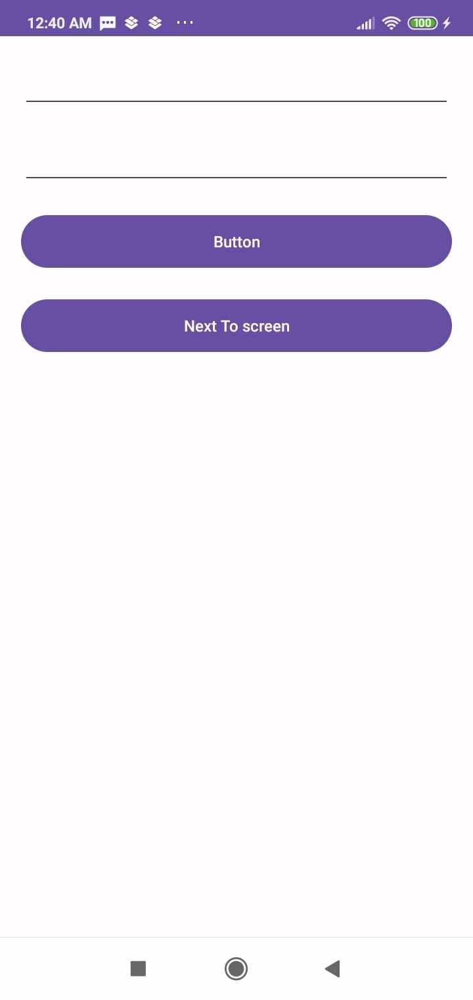

# Family Safety
This app help me to learn fast components and flow a real project to next level
## Step 1: Create UI Security only

## Step 2: Bottom Navigation | Colors | Manifest
- Create Bottom Navigation Bar UI
- Create Color Values
- Create Calculator UI with name LoginActivity
- Handle logic calculator

- Change Manifest main to Calculator UI (LoginActivity)
## Step 3: Fragment
- Create Fragment
- Move UI Security to Fragment
- Create others Fragment and handle logic
